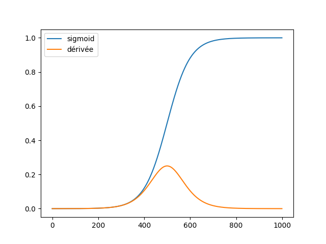

# Rapport - Ludovic Estival

# TP 1 - Perceptron

## Partie 1 - Perceptron simple

### Exercice 1

### Exercice 2

1. Pourquoi `heaviside` pose un problème pour l'apprentissage par gradient ?
L'apprentissage par gradient nécessite l'utilisation des dérivées or `heaviside` n'est pas dérivable. On est donc obligé de passer par la distribution de Dirac.

2. Dans quels cas utiliser `sigmoid` ou `tahn` ?
On peut utiliser Sigmoid dans le cas où on souhaite obtenir une sortie binaire.
On peut utiliser Tanh si on souhaite classer les résultats entre -1 et 1.

3. Pourquoi `relu` est-elle si populaire dans les réseaux profonds ?

Elle est moins coûteuse à calculer car on ne retrouve pas d'exponentielles comme avec `sigmoid` et `tahn`.
De plus, elle annule toutes les valeurs négatives.

4. Quel est l'avantage de `leaky relu` ?

Elle laisse passer les valeurs négatives, contrairement à `relu`.

## Partie 2 - Apprentissage du perceptron

### Exercice 3

1 & 2. Que se passe t-il si `n` est trop grand ? Et s'il est trop petit ?
Si `n` est trop grand, cela va corriger les poids trop rapidement. 

S'il est trop petit, cela ne va pas suffisament corriger les poids. Le modèle va donc apprendre lentement et il faudra plus d'itérations.

3. Existe t-il une valeur idéale de `n` ?

Je pense qu'il ne doit pas exister de valeur universelle idéale pour tous les cas. La valeur de `n` doit être choisie selon chaque cas, j'imagine.

4. Peut-on faire varier `n` au cours du temps ?

Je ne vois pas ce qui nous empêcherait de le faire.

5. Quelle stratégie pouvez vous imaginer ?

---

# TP 2 - Perceptron multi-couches

## Partie 1 - Limites du Perceptron et introduction aux réseaux multicouches

### Exercice 1.1

1. Que signifie concrètement le théorème d'approximation universelle ?
On peut approximer n'importe quelle fonction avec un perceptron multi-couches. En théorie, une seule couche suffit pour faire cela.

2. Ce théorème garantit-il qu'on peut toujours trouver les bons poids ?
Non, il garantit qu'il existe une approximation mais il ne nous garantit pas qu'on arrivera à les trouver.

3. Quelle est la différence entre "pouvoir approximer" et "pouvoir apprendre" ?
Approximer : s'approcher du résultat attendu sans jamais l'atteindre exactement
Apprendre : trouver le résultat attendu

4. Pourquoi utilise-t-on souvent beaucoup plus de couches cachées en pratique ?
On utilise beaucoup plus de couches cachées en pratique pour obtenir une meilleure approximation du résultat.

5. En principe, vous avez déjà vu au lycée un autre type d'approximateur de fonctions, donner leurs noms.
Je ne me souviens d'aucun approximateur de fonctions.

### Exercice 1.2

## Partie 2 - Propagation avant

